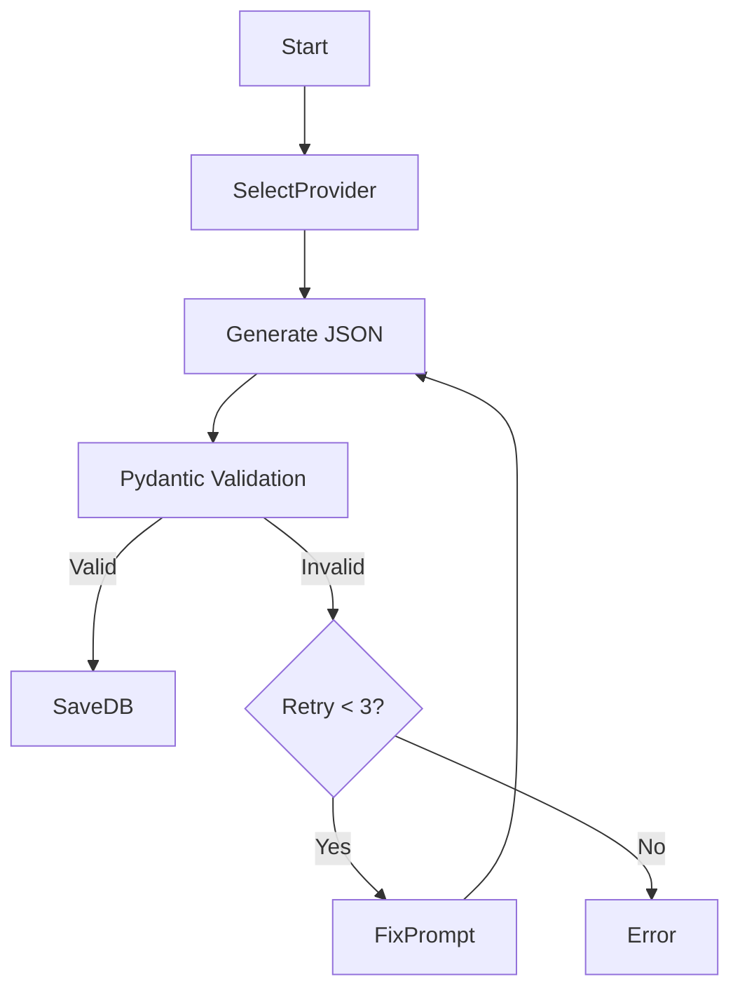

# ADR-0005 — LangGraph for AI Pipelines

**Status:** Accepted  
**Date:** 2024-12-15  
**Context:** AI tasks (Quiz Generation, Summary Evaluation) are becoming complex multi-step processes involving validation, retries, and provider fallback. Linear scripts are hard to debug/maintain.

## Decision

Use **LangGraph** (Stateful Multi-Actor Applications) to orchestration AI workflows.

**Structure:**

- **Graph State:** Shared TypedDict (e.g. `{ content_text: str, quiz: List[Q], attempts: int }`).
- **Nodes:** Python functions for specific steps (e.g., `generate_questions`, `validate_json`, `fallback_provider`).
- **Edges:** Conditional logic (`if validation_fails -> retry`, `if success -> save`).

**Boundaries:**

- **Frontend/API:** Does NOT run LangGraph.
- **Worker (Python):** Runs LangGraph.
- **Communication:** API pushes Job to RabbitMQ -> Worker executes Graph -> Worker updates DB.

## Consequences

**Positive:**

- **Visualizable:** Can graph the logic.
- **Resilient:** Built-in loops/retries for HAL (Hallucination) checks.
- **State Persistence:** Can pause/resume graphs (future).
- **Separation:** Keeps complex prompt engineering out of Node.js API.

**Negative:**

- **Python dependency:** Need to maintain Python environment alongside Node.js.
- **Latency:** Async job queue means no instant AI response (UI must show loading).

## Alternatives Considered

### 1. LangChain Chains (Linear)

Rejected. Too rigid for "Loop if validation fails" logic.

### 2. Node.js LangChain

Rejected. Python ecosystem for AI/LLMs is superior (Pydantic, most up-to-date libraries).

### 3. Raw OpenAI API Calls

Rejected. Too much boilerplate for fallbacks, parsing, and retries.

## Example Flow (Asset Generation L3)

## Links

- [AI Pipelines](../07-jobs-and-ai/02-ai-pipelines-langgraph.md)
- [Multi-Provider ADR](./adr-0006-multi-provider-llm.md)
