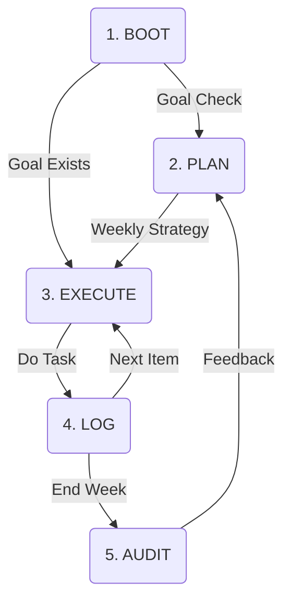

# OpsCoach System Overview

**Status**: In Development (Phase 4)
**Owner**: Antigravity Team
**Last Updated**: 2025-12-21

## 1. Vision

OpsCoach transforms the platform from a "Passive Content Library" to an "Active Learning Operations Center". It manages the student's **Time**, **Energy**, and **Focus** through a cyclical, agentic workflow.

## 2. Core Architecture: The Ops Cycle

The system operates on a state machine with 5 distinct phases:

### 2.1 The 5 Phases (Nodes)

1.  **BOOT (Daily)**

    - **Purpose**: Initialize the day context.
    - **Logic**: Checks if `DailyGoal` exists. If not, prompts user: "What is your main goal for today?".
    - **Output**: Daily Context established.

2.  **PLAN (Weekly/Daily)**

    - **Purpose**: Define strategy.
    - **Logic**: Sunday planning ritual. Identifies weak areas (SRS metrics), priority content, and available hours.
    - **Output**: `OpsEvent { type: 'WEEKLY_PLAN' }`.

3.  **EXECUTE (The Loop)**

    - **Purpose**: Get things done.
    - **Logic**: Manages a smart Queue of tasks.
    - **Context**: Awareness of Energy Level (High/Low) and Time Available.
    - **Output**: Serving the next actionable item (Reading, Quiz, Review).

4.  **LOG (Tracking)**

    - **Purpose**: Frictionless recording.
    - **Logic**: Parses natural language inputs (e.g., "/log 30m reading about Biology").
    - **Output**: `OpsEvent { type: 'TIME_LOG' }`.

5.  **AUDIT (Review)**
    - **Purpose**: Reflection and improvement.
    - **Logic**: Compares `WEEKLY_PLAN` vs `TIME_LOG`s. Calculates Variance. Detects biases (e.g., avoiding Math).
    - **Output**: Performance Report.

## 3. Implementation Details

### Stack

- **Framework**: LangGraph (State Graph)
- **Language**: Python 3.11+
- **Persistence**: MemorySaver (Checkpointer)
- **Integration**: FastAPI endpoint `/ops/turn`

### Data Models

**OpsSnapshot**

- Captures the state of the learner at a specific point in time.
- Used for time-travel debugging and context restoration.

**OpsEvent**

- Immutable ledger of operational actions.
- Types: `DAILY_BOOT`, `WEEKLY_PLAN`, `TIME_LOG`, `TASK_COMPLETE`.

## 4. User Interface

- **PromptDrawer**: The primary interface for communicating with OpsCoach.
- **OpsDashboard**: Visualizes the cycle, current queue, and daily progress.
- **Context Cards**: "What's Next" cards injected into the main feed.

## 5. Deployment

- Runs as a sidecar service to the main Learning Agent.
- Shares the same LLM Factory and Vector Store.
