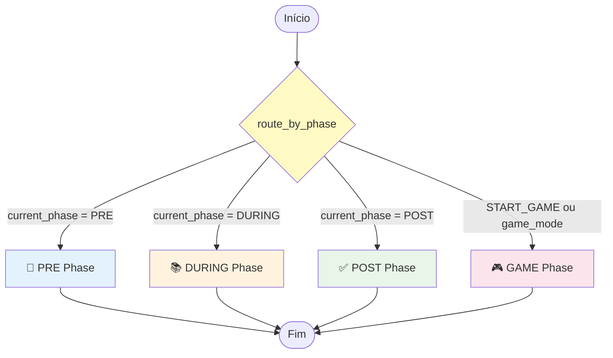
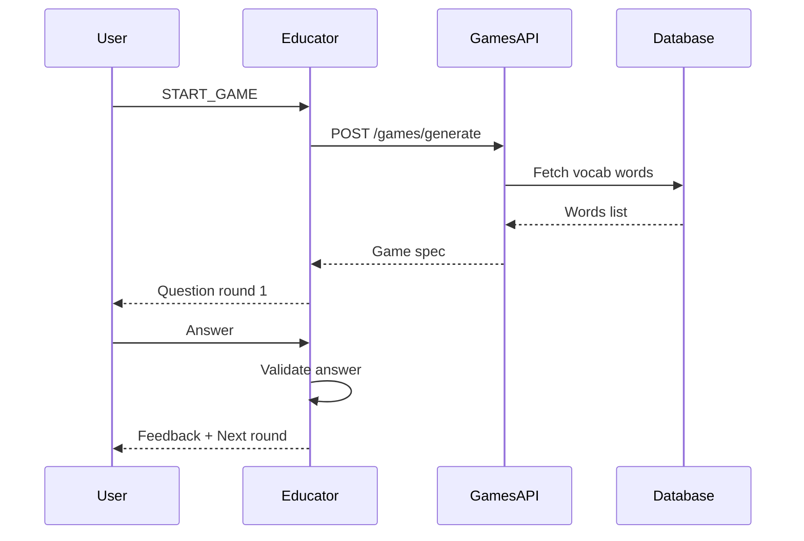
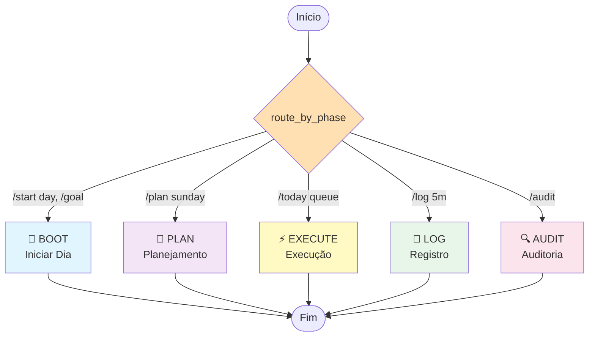
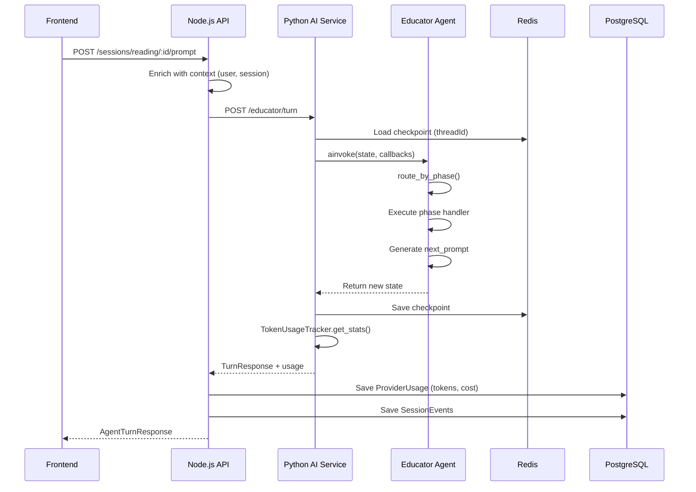
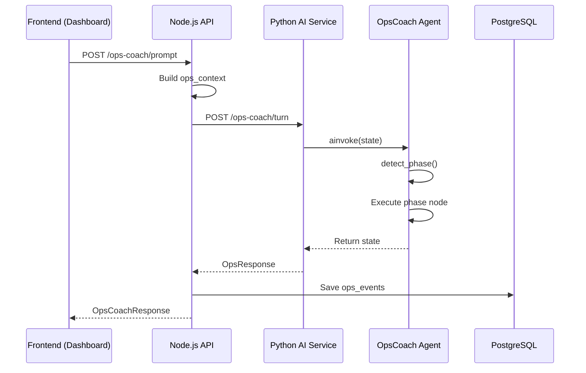

# AprendeAI - Sistema de Agentes de IA

**Versão:** 3.0
**Data:** 04/01/2026
**Arquitetura:** LangGraph + LangChain + Determine Graph Ecosystem  
**Checkpointing:** Redis (Educator) | MemorySaver (OpsCoach)

---

## 📋 Índice

1. [Visão Geral](#visão-geral)
2. [Agente 1: Educator](#agente-1-educator)
3. [Agente 2: OpsCoach](#agente-2-opscoach)
4. [Componentes Compartilhados](#componentes-compartilhados)
5. [Ecossistema de Grafos](#ecossistema-de-grafos)
6. [Fluxo de Dados](#fluxo-de-dados)
7. [Monitoramento e Observabilidade](#monitoramento-e-observabilidade)

---

## 🎯 Visão Geral

O AprendeAI utiliza **2 agentes LangGraph** especializados para diferentes contextos de aprendizado:

| Agente       | Contexto              | Framework          | Estado Persistente   |
| ------------ | --------------------- | ------------------ | -------------------- |
| **Educator** | Sessões de leitura    | LangGraph + Redis  | ✅ Sim (multi-turno) |
| **OpsCoach** | Produtividade pessoal | LangGraph + Memory | ❌ Não (single-turn) |

### Tecnologias

- **LangGraph:** Orquestração de agentes com grafos de estado
- **LangChain:** Abstrações de LLM, prompts, parsers
- **Providers:** OpenAI (GPT-4), Anthropic (Claude), Google (Gemini)
- **Checkpointing:** Redis (persistência distribuída) + MemorySaver (em memória)
- **Token Tracking:** Callback system integrado com analytics

---

## 🎓 Agente 1: Educator

### Propósito

Acompanhar o aluno durante **sessões de leitura**, oferecendo suporte pedagógico adaptativo nas fases de pré-leitura, leitura ativa, pós-leitura e jogos educacionais, além de gerenciar **Productive Failure** e **PKM Generation**.

### Arquivo Principal

[`services/ai/educator/agent.py`](file:///c:/projects/aprendeai-app/services/ai/educator/agent.py)

### Estado (EducatorState)

```python
class EducatorState(TypedDict):
    # === INPUT ===
    prompt_message: Dict       # PromptMessageDto do NestJS
    context: Dict              # ContextPack (session, user, content)

    # === PROCESSING ===
    current_phase: str         # PRE | DURING | POST | GAME
    user_text: str             # Texto extraído do prompt
    parsed_events: List[Dict]  # Eventos de quick commands

    # === GAME-SPECIFIC ===
    game_mode: Optional[str]         # ID do jogo ativo
    game_round_data: Optional[Dict]  # Especificação da rodada
    game_metadata: Optional[Dict]    # Metadados do jogo

    # === OUTPUT ===
    next_prompt: str              # Resposta do agente
    quick_replies: List[str]      # Opções de resposta rápida
    events_to_write: List[Dict]   # Eventos para persistir
    hil_request: Optional[Dict]   # Requisição Human-in-Loop
```

### Grafo LangGraph



### Fases e Funcionalidades

#### 📖 1. PRE Phase (Pré-Leitura)

**Arquivo:** [`educator/nodes/pre_phase.py`](file:///c:/projects/aprendeai-app/services/ai/educator/nodes/pre_phase.py)

**Objetivo:** Preparar o aluno para a leitura, ativando conhecimento prévio.

**Funcionalidades:**

- ✅ Geração de perguntas pré-leitura baseadas no conteúdo
- ✅ Ativação de conhecimento prévio com perguntas socráticas
- ✅ Definição de objetivos de leitura personalizados
- ✅ Orientação sobre estratégias de anotação (Cornell Notes)

**Exemplo de Interação:**

```
User: [Inicia sessão de leitura]
Educator: "Antes de começarmos a ler sobre 'Fotossíntese',
           o que você já sabe sobre como as plantas se alimentam?"
Quick Replies: ["Não sei nada", "Sei o básico", "Sei bastante"]
```

---

#### 📚 2. DURING Phase (Leitura Ativa)

**Arquivo:** [`educator/nodes/during_phase.py`](file:///c:/projects/aprendeai-app/services/ai/educator/nodes/during_phase.py)

**Objetivo:** Suporte em tempo real durante a leitura.

**Funcionalidades:**

- ✅ **Vocabulário:** Responde a palavras marcadas como desconhecidas
  - Fornece definições contextualizadas
  - Cria micro-glossários
  - Sugere sinônimos apropriados ao nível do aluno
- ✅ **Checkpoints:** Gera e avalia pontos de verificação
  - Perguntas de compreensão em intervalos estratégicos
  - Feedback imediato sobre respostas
  - Scaffolding adaptativo se o aluno estiver com dificuldades
- ✅ **Scaffolding:** Oferece suporte quando o aluno trava
  - Simplifica trechos complexos
  - Fornece exemplos ou analogias
  - Divide conceitos em partes menores

**Exemplo de Interação:**

```
User: [Marca palavra "clorofila"]
Educator: "Registrado: clorofila

           Clorofila é o pigmento verde nas plantas que captura
           luz solar para fazer a fotossíntese. É como se fosse
           o 'painel solar' da planta!"

Quick Replies: ["Continuar", "Ver micro-glossário"]
```

---

#### ✅ 3. POST Phase (Pós-Leitura)

**Arquivo:** [`educator/nodes/post_phase.py`](file:///c:/projects/aprendeai-app/services/ai/educator/nodes/post_phase.py)

**Objetivo:** Consolidar o aprendizado e avaliar compreensão.

**Funcionalidades:**

- ✅ **Resumo Guiado:** Solicita que o aluno resuma em suas palavras
- ✅ **Perguntas Reflexivas:** Conexões entre conceitos, aplicações práticas
- ✅ **Revisão Cornell:** Valida anotações Cornell do aluno
- ✅ **Recomendações:** Sugere próximos passos (jogos, leituras relacionadas)

**Exemplo de Interação:**

```
Educator: "Você terminou a leitura! 🎉

           Em 2-3 frases, me explique: o que é fotossíntese
           e por que ela é importante?"

Quick Replies: ["Começar resumo", "Revisar anotações", "Jogar um jogo"]
```

---

#### 🎮 4. GAME Phase (Jogos Educacionais)

**Arquivo:** [`educator/nodes/game_phase.py`](file:///c:/projects/aprendeai-app/services/ai/educator/nodes/game_phase.py)

**Objetivo:** Reforçar aprendizado através de jogos gamificados.

**Funcionalidades:**

- ✅ **Integração com Games System:** Conecta com o sistema de jogos do AprendeAI
- ✅ **Geração de Quizzes:** Perguntas baseadas no conteúdo lido
- ✅ **Boss Fight Vocab:** Batalhas de vocabulário com palavras marcadas
- ✅ **Taboo Game:** Jogo de adivinhação com conceitos do texto
- ✅ **Free Recall:** Desafio de recordação livre

**Exemplo de Interação:**

```
User: START_GAME
Educator: "🎮 Iniciando Boss Fight de Vocabulário!

           Você enfrentará um chefe usando as 5 palavras que
           você marcou durante a leitura. Pronto?"

Quick Replies: ["Começar!", "Escolher outro jogo"]
```

#### 🧩 5. PRODUCTIVE FAILURE (Falha Produtiva)

**Trigger:** `DecisionService` detecta `LowMastery` + `ContentHasPFAssets`.

**Objetivo:** Apresentar um desafio complexo antes do ensino formal para preparar o terreno cognitivo.

**Funcionalidades:**

- ✅ **Assign Mission:** Atribui missão PF genérica.
- ✅ **Feedback em Camadas:** Feedback determinístico (Metadata) -> Feedback LLM (se necessário).
- ✅ **Mastery Loop:** Atualiza score de maestria baseado em tentativas.

#### 🧠 6. PKM GENERATION (Gestão de Conhecimento)

**Trigger:** Fase `POST` + Síntese Qualificada.

**Objetivo:** Transformar a sessão em notas atômicas permanentes.

**Funcionalidades:**

- ✅ **Extração Determinística:** Título, Definições e Backlinks via `section_transfer_metadata`.
- ✅ **Integração Cornell:** Converte notas Cornell em parágrafos estruturados.
- ✅ **Grafo de Conhecimento:** Cria nós e arestas no `TopicGraph`.

**Fluxo de Jogo:**



---

### 🎭 2.5 Adaptabilidade por Modo de Leitura

O comportamento do **Educator Agent** muda drasticamente dependendo do **Modo de Leitura** selecionado na interface (Técnico, Narrativo, Didático, etc.). Isso é alcançado através da injeção de instruções de sistema específicas no `ContextPack`.

| Modo          | Perfil da IA ("Persona")           | Comportamento do Agente                                                                                                                                                                               |
| :------------ | :--------------------------------- | :---------------------------------------------------------------------------------------------------------------------------------------------------------------------------------------------------- |
| **Técnico**   | _Especialista Sênior / Consultor_  | • Prioriza definições exatas e concisas<br>• Evita perguntas socráticas longas<br>• Foco em recuperação de informação (RAG)<br>• Checkpoints apenas em conceitos chave complexos                      |
| **Narrativo** | _Contador de Histórias / Mediador_ | • Mantém a imersão ("flow")<br>• Evita interrupções desnecessárias<br>• Foco na compreensão do enredo e personagens<br>• Responde dúvidas sem quebrar a "quarta parede" se possível                   |
| **Didático**  | _Professor / Tutor Socrático_      | • Maximiza o scaffolding (andaimes cognitivos)<br>• Verifica compreensão frequentemente (checkpoints curtos)<br>• Incentiva conexões com conhecimento prévio<br>• Explica o "porquê" antes do "o quê" |
| **Idiomas**   | _Instrutor de Línguas_             | • Simplifica vocabulário complexo<br>• Oferece traduções contextuais<br>• Foca em aquisição de vocabulário (target words)<br>• Corrige gramática suavemente nas respostas do aluno                    |

**Como funciona tecnicamente:**

1. O Frontend envia o `uiMode` no `metadata` do prompt.
2. O `ContextBuilder` traduz esse modo em um bloco de instruções de sistema ("System Instructions").
3. O LLM utiliza essas instruções para modular o tom, a complexidade e a proatividade da resposta.

---

### Roteamento Inteligente

**Função:** `route_by_phase(state)`

```python
def route_by_phase(state: EducatorState) -> str:
    phase = state['current_phase'].lower()
    user_text = state.get('user_text', '').upper()

    # Prioridade: Game mode
    if user_text == 'START_GAME' or state.get('game_mode'):
        return "game"

    # Rotear por fase da sessão
    return phase  # "pre", "during", ou "post"
```

**Lógica:**

1. Se `START_GAME` → `game` phase
2. Senão, usa `current_phase` da sessão (gerenciado pelo NestJS)

---

### Checkpointing e Persistência

**Tecnologia:** Redis + RedisSaver (LangGraph)

**Benefícios:**

- ✅ **Multi-turn:** Conversas contínuas entre várias requisições
- ✅ **Distributed:** Estado compartilhado entre múltiplas instâncias
- ✅ **Persistent:** Sobrevive a restarts do serviço
- ✅ **TTL Support:** Expiração automática de checkpoints antigos

**Configuração:**

```python
redis_url = os.getenv("REDIS_URL", "redis://localhost:6379/0")
redis_client = redis.Redis.from_url(redis_url, decode_responses=False)
checkpointer = RedisSaver(redis_client)
educator_graph = workflow.compile(checkpointer=checkpointer)
```

**Thread ID:** Cada sessão de leitura tem um `threadId` único que preserva o histórico de conversas.

---

## 🎯 Agente 2: OpsCoach

### Propósito

Coaching operacional para **produtividade pessoal** de alunos (dashboard goals/tasks). Suporta metodologia GTD adaptada para estudantes.

### Arquivo Principal

[`services/ai/ops_coach/agent.py`](file:///c:/projects/aprendeai-app/services/ai/ops_coach/agent.py)

### Estado (OpsCoachState)

```python
class OpsCoachState(TypedDict):
    # === INPUT ===
    learner_id: str     # ID do usuário
    prompt_text: str    # Texto do prompt
    ui_mode: str        # "PLAN" | "EXECUTE" | "AUDIT"

    # === PROCESSING ===
    ops_context: Dict[str, Any]  # Profile + weekly_plan + time_summary
    current_phase: str           # BOOT | PLAN | EXECUTE | LOG | AUDIT

    # === OUTPUT ===
    next_prompt: str              # Resposta do coach
    quick_replies: List[str]      # Opções de ação
    events_to_write: List[Dict]   # Eventos para persistir
    hil_request: Optional[Dict]   # Human-in-loop
```

### Grafo LangGraph



### Nodes e Funcionalidades

#### 🌅 1. BOOT (Iniciar Dia)

**Arquivo:** [`ops_coach/nodes/ops_boot.py`](file:///c:/projects/aprendeai-app/services/ai/ops_coach/nodes/ops_boot.py)

**Objetivo:** Definir intenções e prioridades do dia.

**Funcionalidades:**

- ✅ Revisão de metas semanais
- ✅ Priorização de tarefas (MIT - Most Important Tasks)
- ✅ Estimativa de tempo disponível
- ✅ Definição de foco principal do dia

**Comandos:**

- `/start day`
- `/goal [meta]`

**Exemplo:**

```
User: /start day
OpsCoach: "Bom dia! Vamos planejar seu dia.

           Meta da semana: 'Estudar para prova de Biologia'

           Qual é a tarefa MAIS importante que você precisa
           fazer hoje para avançar nessa meta?"

Quick Replies: ["Ler capítulo 3", "Fazer exercícios", "Revisar anotações"]
```

---

#### 📅 2. PLAN (Planejamento Semanal)

**Arquivo:** [`ops_coach/nodes/ops_plan.py`](file:///c:/projects/aprendeai-app/services/ai/ops_coach/nodes/ops_plan.py)

**Objetivo:** Planejamento estratégico da semana.

**Funcionalidades:**

- ✅ Distribuição de tarefas ao longo da semana
- ✅ Balanceamento de carga de estudo
- ✅ Consideração de deadlines e compromissos
- ✅ Sugestões de blocos de tempo (time-blocking)

**Comandos:**

- `/plan sunday` (planejamento dominical)
- `/planning`

**Exemplo:**

```
User: /plan sunday
OpsCoach: "Hora do planejamento semanal! 📅

           Você tem 3 provas na próxima semana:
           - Matemática (quarta)
           - Química (quinta)
           - História (sexta)

           Vamos distribuir o estudo nos próximos 7 dias?"
```

---

#### ⚡ 3. EXECUTE (Fila de Execução)

**Arquivo:** [`ops_coach/nodes/ops_execute.py`](file:///c:/projects/aprendeai-app/services/ai/ops_coach/nodes/ops_execute.py)

**Objetivo:** Gestão da execução no momento presente.

**Funcionalidades:**

- ✅ Exibição da fila de tarefas priorizadas
- ✅ Sugestão da próxima ação (Next Action - GTD)
- ✅ Motivação e accountability
- ✅ Gestão de interrupções

**Comandos:**

- `/today queue`
- `/execute`
- `/next`

**Exemplo:**

```
User: /today queue
OpsCoach: "📋 Fila de hoje:

           1. 🎯 [30min] Ler capítulo 3 de Biologia
           2. ✏️ [20min] Resolver 5 exercícios de Matemática
           3. 📝 [15min] Revisar anotações de História

           Começar pela tarefa #1?"

Quick Replies: ["Começar", "Reorganizar", "Adicionar tarefa"]
```

---

#### 📝 4. LOG (Registro de Progresso)

**Arquivo:** [`ops_coach/nodes/ops_log.py`](file:///c:/projects/aprendeai-app/services/ai/ops_coach/nodes/ops_log.py)

**Objetivo:** Registro rápido de atividades completadas.

**Funcionalidades:**

- ✅ Log de tempo gasto em tarefas
- ✅ Marcação de tarefas como concluídas
- ✅ Registro de bloqueios ou dificuldades
- ✅ Atualização de progresso em metas

**Comandos:**

- `/log 5m [tarefa]` (logar 5 minutos)
- `/log 10m [tarefa]`
- `/close day`

**Exemplo:**

```
User: /log 30m Estudei capítulo 3
OpsCoach: "✅ Registrado: 30min em 'Estudar Biologia'

           Progresso hoje: 30/120min planejados

           Continue assim! Próxima tarefa na fila?"

Quick Replies: ["Ver próxima", "Fazer pausa", "Encerrar dia"]
```

---

#### 🔍 5. AUDIT (Auditoria e Insights)

**Arquivo:** [`ops_coach/nodes/ops_audit.py`](file:///c:/projects/aprendeai-app/services/ai/ops_coach/nodes/ops_audit.py)

**Objetivo:** Análise de padrões e sugestões de melhoria.

**Funcionalidades:**

- ✅ Análise de produtividade semanal
- ✅ Identificação de padrões de procrastinação
- ✅ Sugestões de ajustes no planejamento
- ✅ Recomendações de recuperação (quando em slump)

**Comandos:**

- `/audit`
- `/slump` (pedir ajuda em baixa produtividade)
- `/recovery`

**Exemplo:**

```
User: /audit
OpsCoach: "📊 Análise Semanal:

           ✅ Produtividade: 75% (acima da média!)
           ⚠️ Padrão detectado: Você estuda melhor entre 14h-17h
           💡 Sugestão: Coloque tarefas difíceis nesse horário

           📈 Meta 'Biologia': 80% completa

           Algum ajuste no plano da próxima semana?"
```

---

### Detecção Automática de Fase

**Função:** `detect_phase(prompt_text, ui_mode)`

```python
def detect_phase(prompt_text: str, ui_mode: str) -> str:
    text_lower = prompt_text.lower()

    # Routing baseado em comandos
    if '/start day' in text_lower or '/goal' in text_lower:
        return 'BOOT'
    elif '/plan sunday' in text_lower:
        return 'PLAN'
    elif '/today queue' in text_lower or '/execute' in text_lower:
        return 'EXECUTE'
    elif '/log' in text_lower and ('5m' in text_lower or '10m' in text_lower):
        return 'LOG'
    elif '/audit' in text_lower:
        return 'AUDIT'

    # Default: BOOT
    return 'BOOT'
```

---

### Diferenças do Educator

| Aspecto           | Educator                | OpsCoach              |
| ----------------- | ----------------------- | --------------------- |
| **Checkpointing** | Redis (persistente)     | MemorySaver (efêmero) |
| **Turn Behavior** | Multi-turn              | Single-turn           |
| **Context Size**  | Grande (texto completo) | Pequeno (summary)     |
| **Use Case**      | Sessões de leitura      | Produtividade         |

---

## 🔧 Componentes Compartilhados

### 1. LLM Factory

**Arquivo:** [`llm_factory.py`](file:///c:/projects/aprendeai-app/services/ai/llm_factory.py)

**Objetivo:** Abstrair seleção de modelo baseada em tier e tipo de tarefa.

**Funcionalidades:**

- ✅ Seleção automática de modelo (GPT-4, Claude, Gemini)
- ✅ Otimização de custo (tier system: FAST, SMART, CREATIVE)
- ✅ Fallback automático quando provider indisponível
- ✅ Configuração centralizada de parâmetros (temperature, max_tokens)

**Exemplo de Uso:**

```python
from llm_factory import llm_factory

# Obter modelo otimizado para custo (tarefas simples)
llm_fast = llm_factory.get_llm(tier="FAST")  # gpt-4o-mini

# Obter modelo para tarefas complexas
llm_smart = llm_factory.get_llm(tier="SMART")  # gpt-4o

# Obter modelo criativo
llm_creative = llm_factory.get_llm(tier="CREATIVE")  # claude-3-5-sonnet
```

---

### 2. Token Usage Tracker

**Arquivo:** [`utils/token_tracker.py`](file:///c:/projects/aprendeai-app/services/ai/utils/token_tracker.py)

**Objetivo:** Rastreamento preciso de usage de tokens via LangChain callbacks.

**Funcionalidades:**

- ✅ Captura automática de tokens (prompt + completion)
- ✅ Suporte multi-provider (OpenAI, Anthropic, Gemini)
- ✅ Estimativa de custo em USD
- ✅ Agregação de múltiplas chamadas

**Integração:**

```python
from utils.token_tracker import TokenUsageTracker

# Criar tracker
token_tracker = TokenUsageTracker()

# Injetar no LangGraph
result = await educator_graph.ainvoke(
    initial_state,
    config={"callbacks": [token_tracker]}
)

# Obter estatísticas
stats = token_tracker.get_stats()
# {
#   "prompt_tokens": 150,
#   "completion_tokens": 80,
#   "total_tokens": 230,
#   "cost_est_usd": 0.0023,
#   "requests": 1
# }
```

---

### 3. Context Builder

**Arquivo:** [`utils/context_builder.py`](file:///c:/projects/aprendeai-app/services/ai/utils/context_builder.py)

**Objetivo:** Enriquecer prompts do agente com contexto relevante da sessão.

**Funcionalidades:**

- ✅ Busca de texto do conteúdo (PDF/HTML retrieval)
- ✅ Histórico de eventos da sessão
- ✅ Perfil do aluno (schooling level, reading intent)
- ✅ Memória de long-term (palavras marcadas, conceitos aprendidos)

**Estrutura do ContextPack:**

```python
{
    "session": {
        "id": "session-123",
        "phase": "DURING",
        "progress": 45  # % de leitura
    },
    "user": {
        "id": "user-456",
        "schooling_level": "9_EF",
        "language_proficiency": "B2"
    },
    "content": {
        "title": "Fotossíntese",
        "text_chunk": "...",  # Chunk atual sendo lido
        "full_text": "..."    # Texto completo (se pequeno)
    },
    "memory": {
        "unknown_words": ["clorofila", "estômatos"],
        "concepts_learned": ["fotossíntese", "luz solar"]
    }
}
```

---

### 4. Chains (Geração de Conteúdo)

**Arquivo:** [`chains.py`](file:///c:/projects/aprendeai-app/services/ai/chains.py)

**Chains Disponíveis:**

```python
# 1. Summarize Chain (Resumo/Simplificação)
# Nível: Premium (GPT-4)
summarize_chain.invoke({
    "text": full_text,
    "layer": "L1", # Nível de complexidade
    "education_level": "MEDIO"
})

# 2. Extract Words Chain (Extração de Vocabulário)
# Nível: Cheap (Gemini Flash)
extract_words_chain.invoke({
    "text": text,
    "education_level": "MEDIO"
})

# 3. Glossary Chain (Definições Contextuais)
# Nível: Cheap (Gemini Flash)
glossary_chain.invoke({
    "words": ["mitocôndria", "atp"],
    "text": context_text
})

# 4. Cornell Cues Chain (Perguntas de Estudo)
# Nível: Balanced (Claude Sonnet)
cues_chain.invoke({
    "text": text,
    "target_words": [...]
})

# 5. Checkpoints Chain (Verificação de Leitura)
# Nível: Balanced (Claude Sonnet)
checkpoints.invoke({...})

# 6. Quiz Chain (Geração de Quiz Múltipla Escolha)
# Nível: Premium (GPT-4)
quiz_chain.invoke({...})
```

---

### 5. AiRateLimiter (Controle de Budget)

**Arquivo:** `services/api/src/ai/ai-rate-limiter.service.ts`

**Objetivo:** Proteger o sistema contra custos excessivos e abuso.

**Funcionalidades:**

- ✅ **Sliding Window:** Limite de N requests por minuto (configurável por Tier).
- ✅ **Daily Budget:** Bloqueio automático de features "nice-to-have" (Ex: Analogias LLM) se budget diário excedido.
- ✅ **Feature Flags:** Habilita/desabilita features por instituição/família.

---

### 6. Scaffolding & Fading Engine

**Arquivo:** `services/api/src/scaffolding/scaffolding.service.ts`

**Objetivo:** Ajustar a intensidade do suporte pedagógico conforme a proficiência (`mastery`).

**Níveis:**

- **L0 (Invisible):** Nenhuma intervenção proativa. Apenas Help-on-demand.
- **L1 (Minimal):** Perguntas de reflexão apenas. Sem analogias longas.
- **L2 (Guided):** Suporte padrão.
- **L3 (Full):** Explicações detalhadas, exemplos concretos, metáforas.

**Fading:**

- Se `mastery_score` > 0.8 E `consistency` > 3 → Reduz nível (L2 -> L1).
- Se `error_pattern` detectado → Aumenta nível (L1 -> L2).

---

## 🧠 Ecossistema de Grafos (Graph Scripts)

O AprendeAI agora conta com um motor de conhecimento estruturado para suportar decisões pedagógicas sem depender exclusivamente de LLMs.

### 1. Topic Graph (Grafo de Tópicos)

Estrutura hierárquica e relacional dos conceitos.

- **Nodes:** Conceitos (Ex: "Fotossíntese", "ATP").
- **Edges:** Relações (Ex: "CAUSES", "PART_OF", "IS_A").
- **Evidence:** Rastreabilidade (Highlight ID, Page Number) para cada aresta.

### 2. Camadas de Grafo

| Camada            | Fonte                                | Confiança         | Propósito                              |
| :---------------- | :----------------------------------- | :---------------- | :------------------------------------- |
| **Baseline**      | TOC, Glossário (PDF/Doc)             | Alta (Estrutural) | Mapa inicial do conteúdo (Cold Start). |
| **Learner**       | Highlights, Notas, Dúvidas           | Média (Pessoal)   | Modelo mental do aluno. Revela "Gaps". |
| **Curated**       | Professores, Comunidade              | Altíssima         | Gold Standard para correçào.           |
| **Deterministic** | Fusão (Curated > Learner > Baseline) | Calculada         | "Source of Truth" para o Agente.       |

### 3. Graph Comparator (A vs B)

Serviço capaz de comparar o Grafo do Aluno (Learner) contra o Baseline ou Curated.

- **Gaps Críticos:** Arestas fundamentais que o aluno não conectou (Missão: `BRIDGING`).
- **Erros Prováveis:** Conexões do aluno que contradizem o Curated (Missão: `CORRECTION`).
- **Descobertas:** Conexões novas que o aluno fez (Insight).

### 4. Decision Weighting (DCS)

Sistema de ponderação para decidir entre **Determinismo (Graph)** vs **Probabilismo (LLM)**.

**Fórmula DCS (Deterministic Confidence Score):**
`DCS = 0.15*Doc + 0.20*Coverage + 0.20*Match + 0.20*Evidence + 0.15*Stability + 0.10*Curation`

- **Se DCS > 0.8:** Bloqueia LLM. Usa resposta do Grafo. (Custo Zero).
- **Se DCS < 0.5:** Permite LLM com contexto enriquecido.
- **Invisible Mode:** Se DCS alto e Aluno em Flow -> Silêncio total.

---

## 📊 Fluxo de Dados

### Educator - Fluxo Completo



### OpsCoach - Fluxo Completo



---

## 📈 Monitoramento e Observabilidade

### 1. Token Tracking

**Endpoints de Analytics:**

- `GET /admin/ai/overview` - Totais (tokens, custo, latência)
- `GET /admin/ai/evolution` - Série temporal (diário/hora)
- `GET /admin/ai/distribution` - Por provider/model/feature
- `GET /admin/ai/top-consumers` - Top users/families/institutions

**Dashboard UI:** [`/admin/ai-usage`](http://localhost:3000/admin/ai-usage)

### 2. Logs Estruturados

Cada node de agente loga:

```python
logger.info(f"DURING phase handler for session {session['id']}")
logger.debug(f"User marked {len(words)} unknown words")
```

**Campos de correlação:**

- `request_id` (via middleware)
- `session_id`
- `thread_id` (LangGraph)
- `user_id`

### 3. Métricas de Otimização

**Endpoint:** `/admin/ai/metrics`

Rastreia:

- Cache hit rate (contexto reutilizado)
- Token reduction (via optimizers)
- Response time (P50, P95, P99)
- Success rate de memory jobs

- Success rate de memory jobs

### 4. Telemetry Aggregator Service

**Arquivo:** `services/api/src/telemetry/telemetry-aggregator.service.ts`

**Objetivo:** Transformar eventos brutos em índices de aprendizado.

**Índices Calculados:**

- **Deep Reading Index:** Tempo de leitura vs profundidade do scroll vs anotações.
- **UI Load Index:** Frequência de uso de ferramentas vs progresso.
- **Completion Quality:** Score de checkpoints + qualidade de resumos.
- **Transfer Index:** Sucesso em missões de transferência (Bridging/PF).

**Policy Overrides:**
Permite que instituições ajustem os limiares (thresholds) dos índices sem alterar código.

---

## 🚀 Próximos Passos e Roadmap

### Melhorias Planejadas

#### Educator

- [ ] **Adaptive Difficulty:** Ajustar complexidade de perguntas baseado no desempenho
- [ ] **Multi-modal:** Suporte a imagens, vídeos, áudios no contexto
- [ ] **Peer Learning:** Conectar alunos em sessões colaborativas
- [ ] **Voice Mode:** Interação por voz (Whisper + TTS)

#### OpsCoach

- [ ] **Habit Tracking:** Acompanhamento de hábitos de estudo
- [ ] **Energy Management:** Sugestões baseadas em níveis de energia
- [ ] **Social Accountability:** Grupos de estudo e desafios
- [ ] **Calendar Integration:** Sincronização com Google Calendar

#### Sistema Geral

- [ ] **A/B Testing Framework:** Testar prompts e estratégias pedagógicas
- [ ] **Fine-tuning:** Modelos customizados para tarefas específicas
- [ ] **RAG Optimization:** Melhorar retrieval de contexto com embeddings
- [ ] **Cost Optimization:** Auto-seleção de modelo baseada em budget

---

## 📚 Referências Técnicas

- **LangGraph Docs:** https://langchain-ai.github.io/langgraph/
- **LangChain Callbacks:** https://python.langchain.com/docs/modules/callbacks/
- **Redis Checkpointer:** https://github.com/langchain-ai/langgraph-checkpoint-redis
- **Architecture Doc:** [`docs/ARCHITECTURE.md`](file:///c:/projects/aprendeai-app/docs/ARCHITECTURE.md)
- **Games System:** [`docs/GAMES_SYSTEM.md`](file:///c:/projects/aprendeai-app/docs/GAMES_SYSTEM.md)

---

**Última Atualização:** 04/01/2026  
**Mantenedores:** Equipe AprendeAI + Agent Antigravity  
**Versão:** 3.0
