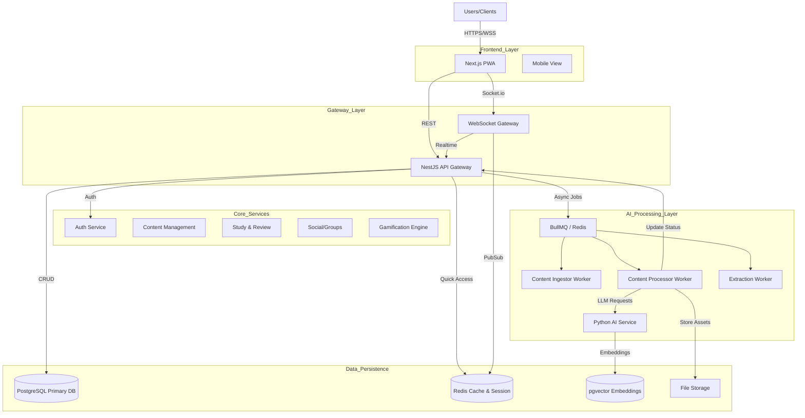
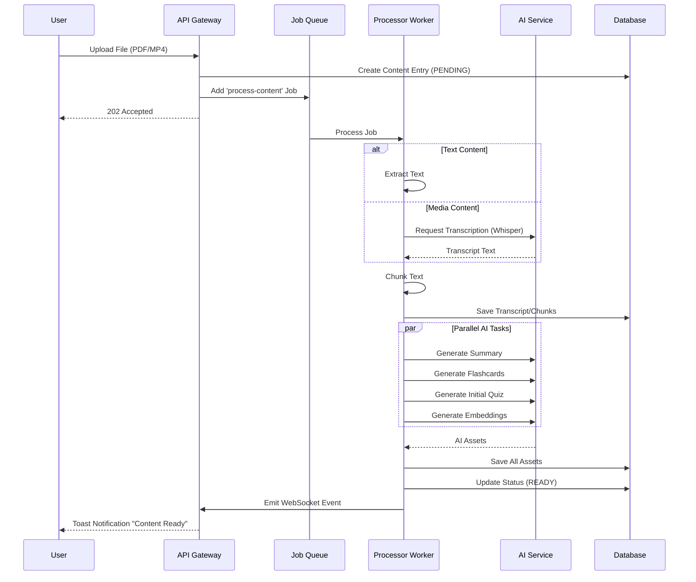
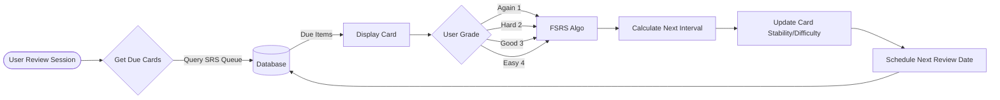
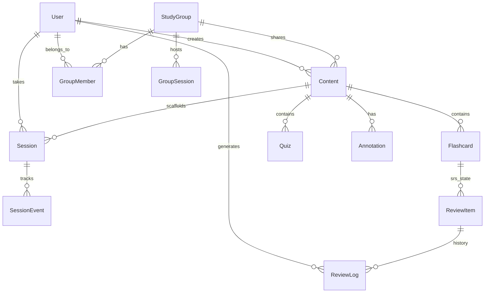

# AprendeAI Platform Architecture

**Version:** 1.0.0 (Production Ready)  
**Date:** December 2025

## 🏗️ High-Level Architecture

AprendeAI is built on a modern, event-driven microservices architecture designed for scalability, real-time interaction, and AI data processing.

---

## 🧩 Core Components

### 1. Frontend Application

- **Framework:** Next.js 14 (App Router)
- **State Management:** Zustand + React Query
- **Styling:** Tailwind CSS + Lucide Icons
- **Real-time:** Socket.io Client
- **PWA:** Service Workers, Manifest, Offline Capability

### 2. API Gateway (Backend)

- **Framework:** NestJS (Node.js)
- **Role:** Central entry point, authentication, orchestration
- **Modules:**
  - `AuthModule`: JWT strategies, Guards, OAuth
  - `ContentModule`: Uploads, metadata, organization
  - `ReviewModule`: SRS logic, flashcards
  - `GroupsModule`: Collaboration, chat
  - `ActivityModule`: Heatmaps, stats tracking

### 3. AI Service (Python)

- **Framework:** FastAPI
- **Dependencies:** LangChain, OpenAI/Anthropic SDKs
- **Capabilities:**
  - Content Summarization
  - Flashcard Generation (JSON Mode)
  - Quiz Generation
  - Semantic Search (Embeddings)
  - Audio Transcription (Whisper)

### 4. Background Workers

- **Queue System:** BullMQ (Redis-based)
- **Worker Types:**
  - `news-ingestor`: Fetches RSS/API feeds
  - `arxiv-ingestor`: Processes academic papers
  - `content-processor`: Orchestrates AI pipelines
  - `extraction-worker`: OCR and text extraction from binaries

---

## 🔄 Critical Data Flows

### A. Content Upload & Processing Pipeline

This flow describes how a raw file (PDF, Video) becomes learnable material.

### B. Spaced Repetition (SRS) Algorithm Flow

How the system queues and reschedules reviews.

---

## 💾 Data Model (ER Diagram)

Key entity relationships powering the platform.

---

## 🛠️ Infrastructure Stack

| Layer        | Technology          | Purpose                        |
| ------------ | ------------------- | ------------------------------ |
| **Compute**  | Docker / K8s        | Container orchestration        |
| **Database** | PostgreSQL 16       | ACID compliant primary store   |
| **Caching**  | Redis 7             | Job queues, caching, PubSub    |
| **Search**   | pgvector            | Vector similarity search       |
| **Storage**  | S3 / MinIO          | Binary file storage            |
| **AI LLM**   | GPT-4o / Claude 3.5 | Logic & generation             |
| **AI Audio** | Whisper             | Speech-to-text                 |
| **CI/CD**    | GitHub Actions      | Automated testing & deployment |

---

## 🔐 Security & Compliance

1. **Authentication:**

   - JWT (Access + Refresh tokens)
   - OAuth 2.0 (Google, Microsoft integration)
   - Password Hashing (Argon2)

2. **Authorization:**

   - RBAC (Role-Based Access Control)
   - Resource Ownership Guards (User can only access their own data)

3. **Data Protection:**
   - Transmit encryption (TLS 1.3)
   - Database encryption at rest attempt
   - Secure HttpOnly Cookies for tokens

---

## 📈 Scalability Strategy

- **Horizontal Scaling:** API Gateway is stateless; multiple instances can run behind a load balancer.
- **Worker Scaling:** Processing workers can be scaled independently based on queue depth.
- **Read Replicas:** Database read replicas for heavy read operations (Flashcard retrieval).
- **CDN:** Static assets and generated media served via CDN edges.
