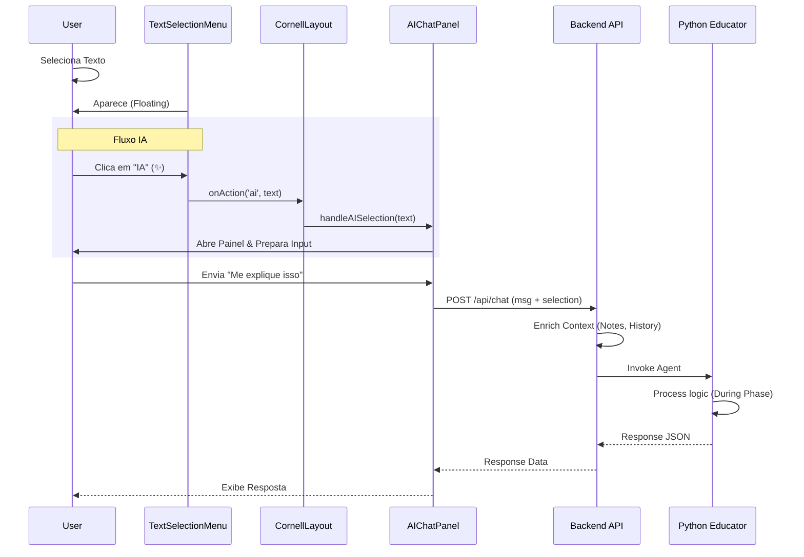

# Visão Geral Técnica: Chat e Menu Destaque (Cornell Note)

Este documento detalha a implementação e interação entre o Menu de Destaque, o Chat Lateral e o Agente Inteligente (`Educator`) no contexto do Cornell Note.

## 1. Funcionalidade Chat no Cornell Note

O Chat (`AIChatPanel.tsx`) atua como a interface primária de interação síncrona com o Agente Educator. Ele não é apenas um chatbot genérico, mas um assistente contextualmente consciente que "lê junto" com o usuário.

### Características Principais

- **Contexto de Seleção:** O chat sabe qual trecho do texto o usuário selecionou.
- **Histórico Persistente:** O histórico conversa com a sessão de leitura (`ReadingSession`).
- **Estados de Digitação:** Feedback visual enquanto o agente "pensa" (processamento Python).
- **Tipos de Mensagem:** Suporta texto livre e respostas estruturadas (Quick Replies).

---

## 2. Menu Destaque (TextSelectionMenu)

O componente `TextSelectionMenu.tsx` é um menu flutuante contextual que aparece automaticamente quando o usuário seleciona texto no leitor.

### Opções Disponíveis

O menu mapeia as ações pedagógicas definidas no `CORNELL_CONFIG`:

| Ícone | Ação              | Tipo no Backend | Comportamento                                            |
| :---: | :---------------- | :-------------- | :------------------------------------------------------- |
|  🟡   | **Ideia Central** | `MAIN_IDEA`     | Cria anotação de "Importante". Usado pelo Quiz.          |
|  🔵   | **Dúvida**        | `DOUBT`         | Cria anotação de dúvida. Aciona `Doubt Spike Detection`. |
|  🟢   | **Evidência**     | `EVIDENCE`      | Cria aresta no Grafo de Conhecimento.                    |
|  🟣   | **Vocabulário**   | `VOCABULARY`    | Adiciona termo à lista de revisão.                       |
|  ✨   | **IA (Sparkles)** | `AI_CONTEXT`    | **Envia seleção para o Chat.**                           |

---

## 3. Interação: Menu Destaque → Chat

A integração ocorre via `ModernCornellLayout.tsx` no método `handleSelectionAction`:

1. **Gatilho:** Usuário seleciona texto e clica no botão **IA (✨)**.
2. **Evento:** O `TextSelectionMenu` dispara a ação `ai` com o texto selecionado.
3. **Redirecionamento:**
   - O layout chama `layout.handleAISelection(text)`.
   - O painel lateral do Chat é aberto automaticamente (se fechado).
   - O texto selecionado é inserido no campo de input do chat ou enviado como contexto oculto, dependendo da configuração.
   - Um evento de telemetria `AI_CONTEXT_SET` é disparado.

> **Nota:** As outras ações (Dúvida, Evidência, etc.) criam `StreamItems` (anotações) mas _não_ abrem o chat imediatamente, embora o Agente os "leia" silenciosamente para ajustar sua estratégia (ver seção anterior sobre _Status de Ativação_).

---

## 4. Interação: Chat → Agente

O fluxo de dados completo de uma mensagem enviada:

### Frontend (`AIChatPanel`)

1. Captura input e contexto opcional (seleção).
2. `POST /api/chat` com payload:
   ```json
   {
     "user_id": "...",
     "content_id": "...",
     "message": "O que isso significa?",
     "context": { "selection": "Texto selecionado..." }
   }
   ```

### Backend API (`EducatorController`)

1. **Context Enrichment (`ReadingSessionsService`):**
   - Carrega histórico recente (últimos 6 turnos).
   - Injeta metadados de anotações recentes (`MAIN_IDEA`, `DOUBT`).
   - Recupera contexto entre sessões (`Context Resurrection`).
2. **LangGraph (`Educator Agent`):**
   - O estado é hidratado com o contexto enriquecido.
   - O nó `during_phase` processa a mensagem.
   - Se necessário, invoca sub-grafos (`TransferGraph`) para tarefas como Morfologia (se gatilho for implementado).

### Resposta

1. O Agente gera resposta textual + metadados (ex: sugestão de Quiz).
2. API retorna para o Frontend.
3. `AIChatPanel` renderiza a mensagem e, se houver, exibe componentes interativos (ex: botões de ação).

---

## Diagrama de Fluxo


