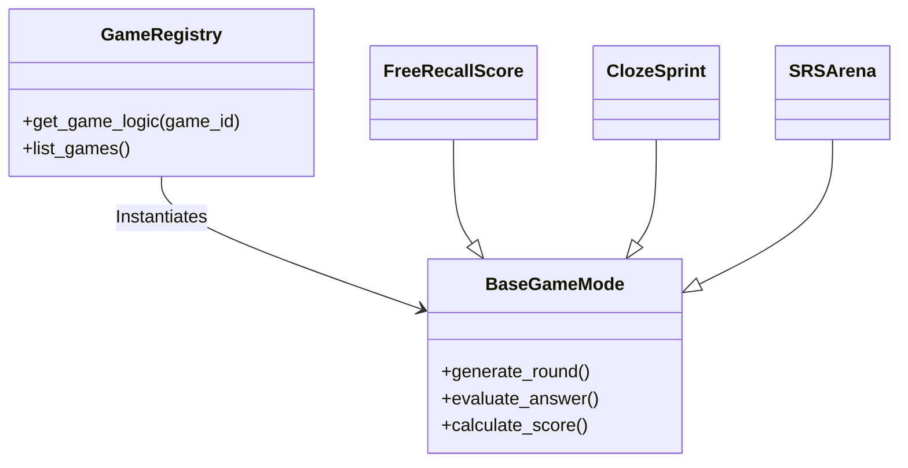

# Sistema de Jogos AI (Game Engine)

O AprendeAI possui uma engine de jogos educacionais baseada em AI (LLMs) projetada para reforçar o aprendizado através de mecânicas de gamificação.

## Arquitetura da Engine

A engine reside em `services/ai/games/` e segue o padrão **Strategy Pattern**, onde cada "Modo de Jogo" é uma estratégia plugável.



### Componentes Principais

1.  **Registry** (`registry.py`): Descobre e carrega dinamicamente os jogos disponíveis.
2.  **Modos (`modes/*.py`)**: Implementação da lógica específica de casa jogo.
3.  **Mastery Tracker** (`mastery/`): Sistema persistente (Redis) que rastreia a proficiência do usuário em cada conceito/palavra.
4.  **Config Loader**: Carrega regras de pontuação e triggers de arquivos YAML (`config/`).

## Modos de Jogo Implementados

Atualmente suportamos 6 modos de jogo divididos em fases pedagógicas:

| ID                   | Nome          | Fase           | Objetivo                 | Mecânica                                          |
| -------------------- | ------------- | -------------- | ------------------------ | ------------------------------------------------- |
| `FREE_RECALL_SCORE`  | Free Recall   | 1. Foundation  | Testar retenção imediata | Usuário lista tudo que lembra sem dicas.          |
| `CLOZE_SPRINT`       | Cloze Sprint  | 1. Foundation  | Contexto e Agilidade     | Preencher lacunas em frases cronometradas.        |
| `SRS_ARENA`          | SRS Arena     | 1. Foundation  | Memória de Longo Prazo   | Revisão de palavras baseada em "esquecimento".    |
| `BOSS_FIGHT_VOCAB`   | Vocab Boss    | 4. Complex     | Desafio Integrado        | "Batalha" contra IA usando vocabulário difícil.   |
| `TOOL_WORD_HUNT`     | Word Hunt     | 5. Specialized | Identificação Contextual | Encontrar usos de ferramentas/palavras em textos. |
| `MISCONCEPTION_HUNT` | Misconception | 5. Specialized | Pensamento Crítico       | Identificar erros propositais gerados pela IA.    |

## Catálogo Completo de Jogos (Roadmap & Specs)

Abaixo a especificação técnica e pedagógica dos 15 jogos planejados.

### ✅ Jogos Individuais (Implementados)

#### 1. Boss Fight de Vocabulário (`BOSS_FIGHT_VOCAB`)

- **Loop**: Palavra → significado → uso em frase.
- **Mecânica**: 3 “vidas”; erro recebe pista mínima (erro produtivo).
- **Mede**: Recall + qualidade de uso.
- **Fundamento**: Recuperação ativa + feedback imediato.

#### 2. Cloze Sprint (`CLOZE_SPRINT`)

- **Loop**: Agente gera 5–12 frases com lacunas das palavras-alvo.
- **Mecânica**: Tempo curto (2–4 min), dificuldade i+1.
- **Mede**: Acerto + tempo + confiança.
- **Fundamento**: Prática de recuperação em contexto.

#### 3. Caça ao “Tool Word” (`TOOL_WORD_HUNT`)

- **Loop**: Identificar no trecho onde o autor usa uma ferramenta (contraste/inferência).
- **Mecânica**: Marcar 1 frase e explicar em 1 linha.
- **Mede**: Detecção + explicação.
- **Fundamento**: Melhora compreensão estrutural.

#### 4. Detector de Erros (`MISCONCEPTION_HUNT`)

- **Loop**: 3 afirmações (2 corretas, 1 sutilmente errada).
- **Mecânica**: Encontrar a errada e citar evidência no texto.
- **Mede**: Evidência textual e leitura analítica.

#### 5. Resumo sem olhar (`FREE_RECALL_SCORE`)

- **Loop**: Escrever 2–4 linhas sem consultar texto.
- **Mecânica**: Pontua "ideia central + 2 detalhes".
- **Fundamento**: _Testing effect_ robusto.

#### 6. SRS Arena (`SRS_ARENA`)

- **Loop**: Cartas espaçadas viram batalhas rápidas.
- **Mecânica**: Streak + intervalos adaptativos.
- **Fundamento**: Espaçamento melhora retenção.

---

### 📅 Jogos Coletivos & Avançados (Planejados)

#### 7. Teach-Back / Feynman (`FEYNMAN_TEACHER`)

- **Status**: Planejado (Fase 2).
- **Loop**: Explicar → exemplo → responder perguntas.
- **Fundamento**: _Learning by teaching_.

#### 8. Taboo de Vocabulário (`CONCEPT_LINKING`)

- **Status**: Planejado (Fase 2).
- **Mecânica**: Descrever palavra-alvo sem usar palavras proibidas (sinônimos óbvios).
- **Mede**: Flexibilidade semântica.

#### 9. Peer Instruction (`DEBATE_MASTER`\*)

- **Status**: Planejado (Fase 4).
- **Loop**: Votação individual → Discussão → Votação final.
- **Fundamento**: Ganho conceitual via instrução de pares.

#### 10. Escape Room de Compreensão (`SITUATION_SIM`\*)

- **Status**: Planejado (Fase 3).
- **Mecânica**: Cooperação com papéis (Líder de evidências / Vocabulário).
- **Objetivo**: Resolver inferências compostas para "abrir a porta".

#### 11. Quiz Tournament (`PROBLEM_SOLVER`\*)

- **Status**: Planejado (Fase 3).
- **Mecânica**: Perguntas curtas + ranking (estilo Kahoot).

#### 12. Guildas / Missões (`GAMIFICATION_META`)

- **Status**: Feature Transversal (Meta-game).
- **Loop**: Microtarefas semanais somam pontos pro time.
- **Fundamento**: Hábito e frequência.

#### 13. Glossário Vivo (`RECOMMENDATION_ENGINE`\*)

- **Status**: Planejado (Fase 5 - Feature Social).
- **Loop**: Aluno adiciona palavra + definição própria + erro comum. Outros validam.

#### 14. Caça às Evidências Crowd (`TOOL_WORD_HUNT_MP`)

- **Status**: Variação Multiplayer do Jogo 3.
- **Loop**: Crowd-sourcing de evidências para perguntas complexas.

#### 15. Desafio de Reescrita (`ANALOGY_MAKER`\*)

- **Status**: Planejado (Fase 2).
- **Loop**: Reescrever mesmo parágrafo em níveis (Simples/Técnico).
- **Mede**: Preservação de sentido + clareza.

---

## ✅ Status de Implementação

| ID                      | Nome          | Fase | Status      | Arquivo                 | Testes |
| ----------------------- | ------------- | ---- | ----------- | ----------------------- | ------ |
| `FREE_RECALL_SCORE`     | Free Recall   | 1    | ✅ Completo | `free_recall.py`        | ✅     |
| `CLOZE_SPRINT`          | Cloze Sprint  | 1    | ✅ Completo | `cloze_sprint.py`       | ✅     |
| `SRS_ARENA`             | SRS Arena     | 1    | ✅ Completo | `srs_arena.py`          | ✅     |
| `FEYNMAN_TEACHER`       | Teach-Back    | 2    | ✅ Completo | `feynman_teacher.py`    | ✅     |
| `CONCEPT_LINKING`       | Taboo         | 2    | ✅ Completo | `concept_linking.py`    | ✅     |
| `ANALOGY_MAKER`         | Rewrite       | 2    | ✅ Completo | `analogy_maker.py`      | ✅     |
| `SITUATION_SIM`         | Escape Room   | 3    | ✅ Completo | `situation_sim.py`      | ✅     |
| `PROBLEM_SOLVER`        | Quiz          | 3    | ✅ Completo | `problem_solver.py`     | ✅     |
| `WHAT_IF_SCENARIO`      | Prediction    | 3    | ✅ Completo | `what_if.py`            | ✅     |
| `DEBATE_MASTER`         | Debate        | 4    | ✅ Completo | `debate_master.py`      | ✅     |
| `SOCRATIC_DEFENSE`      | Socratic      | 4    | ✅ Completo | `socratic_defense.py`   | ✅     |
| `BOSS_FIGHT_VOCAB`      | Boss Fight    | 4    | ✅ Completo | `boss_fight.py`         | ✅     |
| `TOOL_WORD_HUNT`        | Word Hunt     | 5    | ✅ Completo | `tool_word_hunt.py`     | ✅     |
| `MISCONCEPTION_HUNT`    | Misconception | 5    | ✅ Completo | `misconception_hunt.py` | ✅     |
| `RECOMMENDATION_ENGINE` | Recommender   | 5    | ✅ Completo | `recommendation.py`     | ✅     |

**Total**: 15/15 jogos implementados (100%)

> **Nota sobre LLMs**: Alguns jogos usam mocks temporários para geração de conteúdo. Veja `LLM_INTEGRATION.md` para roadmap de integração completa com modelos reais.

---

## 🌐 API Endpoints

### Backend (Python FastAPI)

**GET `/games`** - List all available games

```json
{
  "games": [
    {
      "id": "CONCEPT_LINKING",
      "name": "Taboo de Conceitos",
      "difficulty_range": [1, 3],
      "duration_min": 3,
      "requires_content": true,
      "game_intent": "understanding"
    }
    // ... 14 more games
  ],
  "total": 15
}
```

**GET `/games/{game_id}`** - Get specific game metadata

```json
{
  "id": "BOSS_FIGHT_VOCAB",
  "name": "Boss Fight: Vocabulário",
  "difficulty_range": [2, 5],
  "duration_min": 7,
  "requires_content": true,
  "game_intent": "solo"
}
```

### API Layer (NestJS)

**GET `/api/games`** - Proxy to AI service `/games` endpoint

- **Module**: `GamesModule` (`services/api/src/games/`)
- **Controller**: `GamesController`
- **Service**: `GamesService` (HTTP client to Python)
- **DTOs**: `GameMetadata`, `GameCatalogResponse`

**Arquitetura**:

```
React Frontend
  ↓ fetch('/api/games')
NestJS API Gateway (:3000/api/games)
  ↓ HTTP GET
Python AI Service (:8001/games)
  ↓ game_registry.discover_games()
15 Game Modules (auto-discovered)
```

---

## 🎨 Frontend Integration

### Games Hub Page

**Location**: `frontend/app/games/page.tsx`

**Features**:

- ✅ **Dynamic Loading** - Fetches games from `/api/games`
- ✅ **Icon Mapping** - Unique icons for all 15 games
- ✅ **Visual Gradients** - Custom gradient per game
- ✅ **Responsive Grid** - 1/2/3 columns based on screen size
- ✅ **Loading States** - Spinner while fetching
- ✅ **Metadata Display** - Duration, difficulty stars

**Component Structure**:

```tsx
<GamesPage>
  <StatsOverview />
  <GamesGrid>
    {games.map((game) => (
      <GameCard
        key={game.id}
        icon={GAME_ICONS[game.id]}
        gradient={GAME_GRADIENTS[game.id]}
        {...game}
      />
    ))}
  </GamesGrid>
</GamesPage>
```

### Adding New Games (Zero Configuration)

1. Create `services/ai/games/modes/my_new_game.py`
2. Implement `BaseGame` protocol
3. Define `GAME_ID`, `create_round()`, `evaluate_answer()`
4. **Done!** - Game appears automatically in frontend

No code changes needed in:

- ❌ Frontend (fetches dynamically)
- ❌ API (generic proxy)
- ❌ Registry (auto-discovery)

---

## 📦 Deployment

### Prerequisites

- Python 3.11+ with dependencies
- Node.js 18+ for NestJS and React
- PostgreSQL (future: for game progress)

### Environment Variables

**AI Service** (`.env`):

```bash
OPENAI_API_KEY=sk-...           # For LLM integration
AI_SERVICE_SECRET=<32-char-hex> # For HMAC auth
PORT=8001
```

**API** (`.env.local`):

```bash
AI_SERVICE_URL=http://localhost:8001
AI_SERVICE_SECRET=<same-as-ai-service>
DATABASE_URL=postgresql://...
```

**Frontend** (`.env.local`):

```bash
NEXT_PUBLIC_API_URL=http://localhost:3000
```

### Running Services

**Development**:

```bash
# Terminal 1 - AI Service
cd services/ai
python -m uvicorn main:app --reload --port 8001

# Terminal 2 - API
cd services/api
npm run start:dev

# Terminal 3 - Frontend
cd frontend
npm run dev
```

**Production** (Docker):

```bash
docker-compose up -d
```

### Health Check

```bash
# Verify all 15 games are discovered
curl http://localhost:8001/games | jq '.total'
# Expected: 15

# Verify API proxy works
curl http://localhost:3000/api/games | jq '.total'
# Expected: 15
```

---

## Como Criar um Novo Jogo

Para adicionar um novo jogo (ex: `ANALOGY_MAKER`):

1.  **Definir Constante**:
    Adicione o ID em `services/ai/games/constants.py`.

2.  **Implementar Lógica**:
    Crie `services/ai/games/modes/analogy_maker.py` herdando de `BaseGameMode`.

    ```python
    class AnalogyMakerGame(BaseGameMode):
        async def generate_round(self, context):
            # Usar LLM para criar desafio
            pass

        async def evaluate_answer(self, user_input, context):
            # Usar LLM para validar analogia
            pass
    ```

## Sistema de Pontuação (Scoring)

A pontuação não é arbitrária. Ela é regida por `config/scoring_rules.yaml`.

- **Base Score**: Pontos fixos por acerto.
- **Multipliers**: Bônus por _Streak_ (sequência de acertos) e _Dificuldade_.
- **Mastery Impact**: Acertos aumentam o "Nível de Maestria" do tópico no Redis, tornando perguntas futuras mais difíceis.

## Integração com Frontend

A API expõe o endpoint `/games/session` para iniciar. O Frontend não conhece a lógica do jogo, ele apenas renderiza o payload `round_data` (pergunta, opções, timer) e devolve a `answer`.

Isso permite criar novos tipos de jogos no Backend (Python) sem necessariamente alterar o código do Frontend, desde que usem os componentes de UI padrão (MultipleChoice, TextInput, etc).
