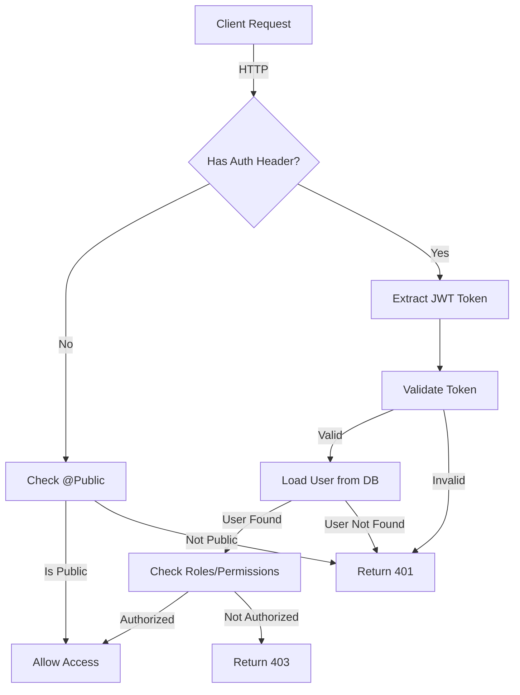

# Authentication Architecture Documentation

## Overview

This document describes the authentication and authorization architecture of the AprendeAI API.

## Authentication Flow



## Middleware Execution Order

### 1. Request ID Middleware

- **Purpose**: Assigns unique ID to each request
- **Runs**: Before all other middleware
- **Applied to**: ALL routes

### 2. Action Logger Middleware

- **Purpose**: Logs request details
- **Runs**: After Request ID
- **Applied to**: ALL routes

### 3. Global JwtAuthGuard

- **Purpose**: Validates authentication
- **Runs**: After middleware, before controllers
- **Applied to**: ALL routes except those with `@Public()`
- **Bypasses**: Routes marked with `@Public()` decorator

### 4. Route Validation Middleware

- **Purpose**: Validates UUIDs and route parameters
- **Runs**: After auth guard
- **Applied to**: Protected routes only
- **Excludes**: Public routes (auth/\*, health)

## Public Routes Configuration

Centralized in `config/public-routes.config.ts`:

```typescript
export const PUBLIC_ROUTES = [
  "/api/v1/health",
  "/api/v1/auth/login",
  "/api/v1/auth/register",
  // ... more routes
];
```

## Guards

### JwtAuthGuard (Global)

**File**: `auth/jwt-auth.guard.ts`

**Responsibility**:

- Check if route has `@Public()` decorator
- If public: Allow access
- If protected: Validate JWT token via Passport

**Logging**:

- `[PUBLIC]` - Route bypassing auth
- `[PROTECTED]` - Route requiring auth
- `[AUTH_FAILED]` - Authentication failed
- `[AUTH_SUCCESS]` - User authenticated

### RolesGuard (Controller-specific)

**File**: `admin/guards/roles.guard.ts`

**Responsibility**:

- Validate user has required role(s)
- Used by Institution, Admin endpoints

**Usage**:

```typescript
@UseGuards(RolesGuard)
@Roles(UserRole.ADMIN, UserRole.INSTITUTION_ADMIN)
```

## Decorators

### @Public()

**File**: `auth/decorators/public.decorator.ts`

**Purpose**: Mark routes that don't require authentication

**Usage**:

```typescript
@Public()
@Get('health')
check() {
  return { status: 'ok' };
}
```

### @Roles(...roles)

**File**: `admin/decorators/roles.decorator.ts`

**Purpose**: Restrict access to specific user roles

**Usage**:

```typescript
@Roles(UserRole.ADMIN)
@Post()
create() { }
```

## Security Layers

### Layer 1: Global Authentication

- **JwtAuthGuard** validates all requests
- **Bypass**: `@Public()` decorator

### Layer 2: Controller Guards

- **Explicit guards** on sensitive controllers
- **Defense in depth**: Works even if global guard fails

### Layer 3: Role-Based Access Control (RBAC)

- **RolesGuard** validates user roles
- **Granular permissions** per endpoint

### Layer 4: Business Logic Validation

- **Membership checks** for groups/families
- **Visibility validation** for annotations
- **Owner verification** for modifications

### Layer 5: Database Constraints

- **Foreign keys** prevent orphaned data
- **Unique constraints** prevent duplicates
- **Prisma type safety**

## Common Patterns

### Protecting an Endpoint

```typescript
// Default: Protected by global JwtAuthGuard
@Get('profile')
getProfile(@CurrentUser() user: User) {
  return user;
}
```

### Making an Endpoint Public

```typescript
@Public()
@Post('login')
login(@Body() credentials: LoginDto) {
  return this.authService.login(credentials);
}
```

### Restricting by Role

```typescript
@UseGuards(RolesGuard)
@Roles(UserRole.AD MIN)
@Delete(':id')
deleteUser(@Param('id') id: string) {
  return this.usersService.delete(id);
}
```

### Group/Family Permission Checks

```typescript
async createHighlight(userId: string, dto: CreateHighlightDto) {
  // Validate membership if sharing with group
  if (dto.visibility === AnnotationVisibility.GROUP) {
    await this.verifyContextAccess(
      userId,
      dto.context_type,
      dto.visibility_scope,
      dto.context_id
    );
  }
  // ... create highlight
}
```

## Troubleshooting

### Endpoint Returns 401

1. **Check if endpoint should be public**
   - Add `@Public()` decorator if needed
   - Verify route is in `PUBLIC_ROUTES` config

2. **Check request has valid token**
   - Verify `Authorization: Bearer <token>` header
   - Check token hasn't expired

3. **Check backend logs**
   - Look for `[AUTH_FAILED]` messages
   - Check reason in log output

### Endpoint Returns 403

1. **Check user role**
   - Verify user has required role
   - Check `@Roles()` decorator on endpoint

2. **Check group/family membership**
   - Verify user is member of group/family
   - Check visibility scope settings

### @Public() Not Working

1. **Check decorator is imported correctly**

   ```typescript
   import { Public } from "./auth/decorators/public.decorator";
   ```

2. **Check decorator is placed correctly**

   ```typescript
   @Public() // Must be BEFORE @Get/@Post/etc
   @Get()
   ```

3. **Check JwtAuthGuard logs**
   - Should see `[PUBLIC]` in logs
   - If not, decorator not being detected

## Testing

### Unit Tests

```typescript
describe("JwtAuthGuard", () => {
  it("should allow public routes", () => {
    // Test @Public() decorator
  });

  it("should block protected routes without token", () => {
    // Test auth requirement
  });
});
```

### E2E Tests

```bash
# Public endpoint (should work without token)
curl http://localhost:4000/api/v1/health

# Protected endpoint (should return 401 without token)
curl http://localhost:4000/api/v1/profile

# Protected endpoint (should work with token)
curl -H "Authorization: Bearer <token>" \
  http://localhost:4000/api/v1/profile
```

## Best Practices

1. **Always use `@Public()` for public endpoints**
   - Don't rely on global guard bypass
   - Makes intent explicit

2. **Use defense in depth**
   - Add explicit `@UseGuards()` on sensitive controllers
   - Don't rely solely on global guard

3. **Validate in business logic**
   - Check membership/ownership
   - Don't trust auth alone

4. **Centralize public routes**
   - Use `PUBLIC_ROUTES` config
   - Keep in sync with decorators

5. **Log authentication events**
   - Use guard logging
   - Monitor for anomalies

6. **Test all security layers**
   - Unit tests for guards
   - E2E tests for flows
   - Security tests for bypass attempts
